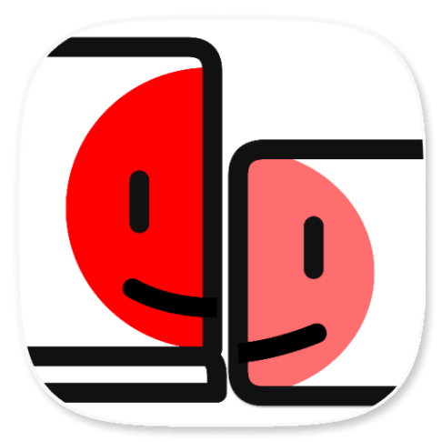

<div align="center">



# OpenDisplay

**Turn your spare Apple devices into second monitors for your Mac — free, open source, no subscription.**

iPhone, iPad, and spare Macs. A self-hosted
alternative to Apple Sidecar, Duet Display, and Luna Display: true extended
display (not just mirroring), Retina-sharp, over USB or WiFi, with touch and
scroll input.

[Website](https://peetzweg.github.io/opendisplay/) · [Quick start](#quick-start) · [How it works](#how-it-works) · [FAQ](#faq) · [Contributing](#contributing)

<br />

<a href="https://ko-fi.com/peetzweg">
  <picture>
    <source media="(prefers-color-scheme: dark)" srcset="assets/support_me_on_kofi_beige.png" />
    
  </picture>
</a>

</div>

---

## About this fork

This is a fork of [peetzweg/opendisplay](https://github.com/peetzweg/opendisplay)
that makes OpenDisplay connect **without a local network**.

Upstream, wireless mode needs both devices on the same WiFi network — a router,
a hotspot, or some other access point in between. This fork removes that
requirement: the Mac and the iOS device link **directly to each other over
Apple's peer-to-peer WiFi (AWDL)**, the same radio link AirDrop and AirPlay use.
No router, no access point, no shared network, no internet.

See [Connecting without a local network](#connecting-without-a-local-network)
for how it works and what it needs. Everything else — USB mode, touch input,
HiDPI, multi-device — behaves exactly as upstream.

## Why OpenDisplay exists

Turning an iPhone or iPad into an external display for a Mac is a solved
problem — but every existing option has a catch:

- **Apple Sidecar** is free but requires both devices on the *same Apple ID*,
  doesn't support iPhones at all, and only works on supported hardware pairs.
- **Duet Display** moved to a subscription.
- **Luna Display** requires a hardware dongle.

OpenDisplay is the missing option: a **free, open-source, no-account,
no-dongle** way to use the iOS device you already own as a true second
display. If you were about to write your own — don't! Contribute here
instead; the hard parts (virtual display creation, low-latency H.264
pipeline, USB transport, input injection) are already working.

## Features

- 🖥️ **True display extension** — macOS treats the device as a real second
  monitor (drag windows to it, arrange it in System Settings), not a mirror.
  Mirroring is also available as a mode.
- 🔌 **USB-wired for lowest latency** — streams over the Lightning/USB-C
  cable via macOS's built-in `usbmuxd`; plug in and go, no network, no
  WiFi jitter, no helper tools.
- 📶 **WiFi with zero config** — the iPhone advertises itself via Bonjour;
  pick it from a dropdown on the Mac.
- 🔍 **Retina / HiDPI** — the virtual display matches the device panel
  pixel-for-pixel (@2x), so text is sharp.
- 👆 **Touch input built in** — your iPhone becomes a touchscreen for macOS:
  **tap to click**, **drag to drag**, and **two-finger scroll** that feels
  like a trackpad. (Apple Pencil support is on the roadmap.)
- 🔄 **Portrait or landscape** — rotate the device and the virtual display
  rebuilds itself as a vertical monitor at native resolution.
- ⚡ **Low-latency pipeline** — hardware H.264 encode (VideoToolbox,
  real-time mode, no B-frames), TCP_NODELAY, frame-drop backpressure with
  keyframe recovery, decode-and-render via `AVSampleBufferDisplayLayer`.
- 💻 **A spare Mac as a display** — install the small *OpenDisplay
  Receiver* app (macOS 12+) on an old Mac and any other Mac extends onto it
  over WiFi or a Thunderbolt/Ethernet cable, at native Retina resolution.
- 🔒 **Self-hosted & private** — your screen never touches anyone's server.
  Two small apps, one TCP connection, that's it.

## Comparison

| | OpenDisplay | Apple Sidecar | Duet Display | Luna Display |
|---|---|---|---|---|
| Price | **Free, open source** | Free | Subscription | $$$ + dongle |
| iPhone as display | ✅ | ❌ (iPad only) | ✅ | ✅ |
| Different Apple IDs | ✅ | ❌ | ✅ | ✅ |
| Wired (USB) | ✅ | ✅ | ✅ | ❌ |
| True extension | ✅ | ✅ | ✅ | ✅ |
| Touch input | ✅ | ✅ | ✅ | ✅ |
| Self-hosted / auditable | ✅ | — | ❌ | ❌ |

## FAQ

**Why do I see the purple screen-recording indicator in the menu bar?**
That's a macOS privacy indicator shown for *any* app that captures the
screen — Duet, Luna, OBS, and Zoom trigger it too. Apple Sidecar doesn't,
only because it's implemented inside the OS rather than on public capture
APIs. It cannot (and shouldn't) be hidden by an app; it's how macOS tells
you a capture is running.

**The Mac app doesn't show my iPhone in the Connection menu (WiFi).**
Both sides need **Local Network** permission, and both fail *silently*
without it: check Privacy & Security → Local Network on the Mac **and** on
the iPhone, make sure both are on the same WiFi network, and keep the
iPhone app open in the foreground. USB mode is unaffected.

**What USB cable or version do I need?** Your cable **must support data** — a
charge-only USB cable will **not** work. Look for a cable described as a
*data*, *sync*, or *charging and data-transfer* cable. A data-capable USB 2.0
cable is enough; USB 3, Thunderbolt, and video Alt Mode are not required.
OpenDisplay streams H.264 over a TCP connection through macOS's built-in
`usbmuxd`, not as a USB video device. Its highest-quality preset uses 18 Mb/s,
well below USB 2.0's 480 Mb/s high-speed link rate, so USB 2.0 has ample
bandwidth for the stream. USB 1.x is not supported or tested. For best
reliability, use a known-good data/sync cable, unlock the device, accept the
**Trust This Computer** prompt if it appears, and avoid unreliable hubs or
adapters.

**Does it support iPad?** The receiver app is universal (iPhone + iPad);
iPad is the same codebase. iPad-specific polish (Pencil, pressure) is on the
roadmap.

**Can another Mac be the display?** Yes. Install **OpenDisplay Receiver**
(a separate, small app from the same release) on the spare Mac. It only needs
**macOS 12 Monterey** or newer, so Macs from around 2015 onward qualify even
though the sending Mac needs macOS 14. The receiver shows up on the sending Mac
like a phone does and becomes a real extended Retina display. Over WiFi it works out of the box. For a cable, connect the two
Macs with a **Thunderbolt or USB4 cable** (macOS creates a *Thunderbolt Bridge*
network between them), with an **Ethernet** cable or adapters, or — on recent
macOS on both Macs — a plain **USB-C data cable** (macOS runs a small network
link over it; approve the *allow accessory to connect* prompt on each Mac,
which appears depending on which Mac is plugged into which). The sender moves
the session onto the cable automatically, even one plugged in mid-session, and
the device row says *Cable*. Older Macs with a Mini DisplayPort-shaped
Thunderbolt 1 or 2 port work with a Thunderbolt 3 to 2 adapter and a
Thunderbolt 2 cable.
Input from the receiving Mac's keyboard and mouse is a follow-up
([#147](https://github.com/peetzweg/opendisplay/issues/147)).

**Do the Larger Text / More Space display settings affect Mac receiver performance?**
Yes, in Extend mode. On a Mac receiver, this setting changes the logical size
of the desktop, not only the apparent text size. OpenDisplay advertises that
desktop at Retina scale, and the sender creates, renders, captures, and encodes
a virtual display with the same working area. **More Space** therefore gives
you room for more windows, but starts with a larger source surface and puts
more pressure on rendering, capture, scaling, encoding, and the network. At a
fixed bitrate it also gives each pixel less data. Moving toward **Larger Text**
reduces that work and can be noticeably smoother, especially over WiFi.

For example, on the 5K iMac used for testing, the less-spacious setting offers
a 1600×900-point desktop and a 3200×1800 stream at up to 60 fps. More Space
offers a 3200×1800-point desktop, which is rendered at 6400×3600; the current
H.264 path safely scales that to 4096×2304 at up to 55 fps. That is about 50%
more encoded pixels per second, in addition to the four-times-larger source
surface. Exact sizes vary by Mac.

Start with the receiver's **Default** setting. Move one or more steps toward
**Larger Text** when smoothness and latency matter most, or toward **More
Space** when desktop area matters and you have a fast wired connection. The
sender's Best/Balanced/Fast setting can reduce the transmitted image further
without changing the desktop's working area. Fullscreen changes presentation
and compositor load, but not the negotiated stream resolution. In Mirror mode,
the sending Mac's display determines the capture resolution, so the receiver's
display setting has much less effect.

**Why H.264 and not HEVC/AV1?** Hardware H.264 encode/decode is universally
fast and the latency is excellent. HEVC is a planned option for better
quality-per-bit.

**Is my screen content sent anywhere?** No. One direct TCP connection
between your Mac and your device, over your cable or your LAN. No servers,
no accounts, no analytics. Full details — including what the apps store
locally and the current WiFi-encryption caveat — on the
[privacy page](https://peetzweg.github.io/opendisplay/privacy.html).

**What's the license? Can I fork it or use it commercially?**
[GPL-3.0](LICENSE). Use, study, and adapt it freely — commercially too. If
you distribute a modified version it must stay open source under the same
license with the original attribution intact, so improvements flow back
instead of into closed forks. (Releases up to v0.4.x were MIT-licensed and
remain available under those terms.)

**Will it break on a macOS update?** Possibly — `CGVirtualDisplay` is
private API. The same risk applies to every virtual-display product.
The capture/streaming pipeline itself uses only public APIs.

**Audio?** Out of scope for now.

## Compatible apps

The official apps cover a Mac sender and an iPhone/iPad receiver on iOS 15+.
Other people have built their own clients that speak the same protocol, so
you can also use an Android device or an older iPad as a display, or drive
one from Linux. The wire protocol is specified in
[PROTOCOL.md](PROTOCOL.md), so a new client can be written against the spec
instead of reverse-engineered from the Swift sources. If your hardware is
not covered yet, start here:

**Android receivers**
* [gprot42/android-opendisplay](https://github.com/gprot42/android-opendisplay) - GrapheneOS receiver for de-Googled Pixel phones and tablets, Android 8.0+
* [josepacelli/opendisplay-android](https://github.com/josepacelli/opendisplay-android) - Android receiver, Android 8.0+, works with an unmodified Mac app

**Older iOS receivers**
* [cuongpham1/ipad-iphone-second-monitor-ios12-free](https://github.com/cuongpham1/ipad-iphone-second-monitor-ios12-free) - iOS 12 client for iPads and iPhones that cannot run the official app

**Linux senders**
* [tixwho/opendisplay-linux](https://github.com/tixwho/opendisplay-linux) - drive an iPhone or iPad from a Wayland desktop (KDE Plasma, Hyprland)

These are fan-made projects, not official builds. They are not affiliated
with OpenDisplay and are not maintained, reviewed, or supported by us, so
please report issues with them in their own repositories. Listing them here
also says nothing about our own plans: an official OpenDisplay app may still
ship for any of these platforms later.

## How it works

```
MAC (sender)                                      iPHONE / iPAD (receiver)
CGVirtualDisplay  ← macOS believes a monitor is attached
   → ScreenCaptureKit (capture the virtual display)
   → VideoToolbox H.264 (hardware, real-time)
   → TCP  [4-byte length][Annex B frame]  ═══════→  NWListener :9000
                                                      → AVSampleBufferDisplayLayer
   ← JSON control messages (hello, touch, scroll) ═══
   → CGEvent injection (click / drag / scroll)
```

The **phone listens and the Mac connects** — that ordering is what makes the
exact same code work over USB (via the `usbmuxd` daemon built into every
macOS install) and WiFi. An iPhone or iPad announces its panel pixels; a Mac
receiver announces the backing size of its current scaled display mode. The
sender creates an @2x `CGVirtualDisplay` with the corresponding logical working
area, negotiates a codec-safe stream raster, and streams the pixels back.

Everything that crosses the socket — framing, discovery, the video format,
every control message — is specified in [PROTOCOL.md](PROTOCOL.md). How the
protocol evolves across releases is covered in
[COMPATIBILITY.md](COMPATIBILITY.md).

`CGVirtualDisplay` is a **private CoreGraphics API** (the same one used by
BetterDisplay and DeskPad) — which is precisely why this project can't ship
on the App Store and lives on GitHub instead.

## Connecting without a local network

OpenDisplay does not need a router, an access point, a hotspot or an internet
connection. If there is no network to join, the Mac and the iOS device build
their own direct WiFi link using **Apple peer-to-peer WiFi (AWDL)** — the same
mechanism behind AirDrop and AirPlay.

There is no separate mode or switch. Open the iOS app, pick the device from the
Connection menu on the Mac, and the system takes the best available path: the
LAN when one exists, a direct peer-to-peer link when one doesn't.

### What makes it work

Peer-to-peer has to be requested on **every leg** of the connection, and the
Bonjour service endpoint has to survive all the way down to the socket:

| Leg | Where | What it does |
|---|---|---|
| iOS listener | `Shared/StreamReceiver.swift` | `params.includePeerToPeer = true`, so the `_opensidecar._tcp` service is advertised over AWDL and not only on the LAN |
| Mac browser | `Mac/OpenSidecarMacApp.swift` | `params.includePeerToPeer = true`, so `NWBrowser` sees peers that have no IP address on any shared subnet |
| Mac connection | `Mac/MacSender.swift` | `params.includePeerToPeer = true`, and it dials `NWConnection(to: result.endpoint)` — the **Bonjour service endpoint itself** |

That last row is the one that is easy to get wrong. Resolving a discovered
service down to an IP address and dialing the IP throws the peer-to-peer path
away, because that address only exists on infrastructure WiFi — the connection
then either fails or quietly falls back to the LAN. Handing the `.service`
endpoint straight to `NWConnection` is what lets Network.framework choose AWDL
when that is the only way to reach the peer.

### Requirements and limits

- **WiFi must be switched on** on both devices — but neither has to be joined to
  a network. AWDL rides on the WiFi radio, so turning WiFi off disables it.
- **Local Network permission is still required**, even with no router. The
  permission gates Bonjour discovery itself, not the network you are on, and
  both sides fail silently without it.
- **Keep Bluetooth on.** macOS and iOS use it to bootstrap AWDL discovery.
- **Keep the devices close.** AWDL is a short-range direct link; throughput and
  latency degrade with distance and obstacles much faster than on a good LAN.
- **Bandwidth is shared with normal WiFi.** There is one radio, and AWDL
  time-slices with any infrastructure network the device is also using. Expect
  less throughput than a cable — USB remains the lowest-latency option.

### Multiple devices at the same time

Connecting an iPhone and an iPad simultaneously works over peer-to-peer WiFi
too. The Mac keeps one independent session per device, each with its own
virtual display, capture stream, encoder and socket, so every device becomes
its own separate extended display rather than another view of the same one.

Two things are worth knowing:

- Give the devices **distinct names**. A WiFi session is keyed by the Bonjour
  service name, which defaults to the device name, so two devices sharing a
  name will collide. The iOS app has a device-name setting if you need it.
- Two live streams **share one radio**. If the picture gets choppy with both
  connected, lower the quality setting, or put one device on USB and leave the
  other on peer-to-peer WiFi — transports are per-session and can be mixed.

### Reliability fix: listener restart loop

Enabling peer-to-peer WiFi exposed a launch-time race in the iOS receiver that
left the app stuck on `Listener failed — restarting...` so it never became
discoverable at all.

`start()` queued the listener bind, and the scene becoming active immediately
queued `ensureListening()` behind it. The listener had not reached `.ready`
yet, so it was judged unhealthy and restarted — and the restart cancelled and
rebound the same fixed port within the same turn. `NWListener.cancel()` does
not release the socket synchronously, so the rebind hit
`POSIX error 48: Address already in use`, which scheduled another restart, for
ever. `includePeerToPeer` did not cause this; bringing up AWDL delays `.ready`
just enough to widen the race window, which is why it surfaced only on wireless
peer-to-peer launches.

The receiver now tracks whether a bind is already in flight, ignores redundant
`ensureListening()` calls while one is, invalidates superseded restarts with a
generation counter, and backs off exponentially (0.5s to 8s) instead of
hammering the port. `allowLocalEndpointReuse` is deliberately not relied on:
testing confirmed it is a no-op for this case (OpenRadar FB8658821).

## Install

You need **two apps**: a Mac app (captures and sends) and an iOS app
(receives and displays). To use a **second Mac** as the display, install
`OpenDisplay Receiver` on it instead of the iOS app.

### Prebuilt downloads (Mac)

Grab `OpenDisplay.dmg` from the
[latest release](https://github.com/peetzweg/opendisplay/releases/latest).
The app is signed with a Developer ID certificate and notarized by Apple, so it
opens with a plain double-click on macOS 14+ — no Gatekeeper warning. Open the
`.dmg` and drag the app to Applications.

For a Mac that should *be* the display, grab `OpenDisplayReceiver.dmg` from
the same release instead. It runs on macOS 12+ and is signed and notarized
the same way; both apps update themselves via Sparkle.

### iPhone app

Needs **iOS / iPadOS 15 or newer**. That reaches the 16.7.x line (iPad 5,
iPad Pro 1st gen, iPhone 8, iPhone X) and the 15.8.x line, where Apple left
the iPad Air 2, the iPad mini 4, the iPhone 6s, 7 and the first SE. If your
iPad can't be updated past 15.8, it can still be a second display
([#72](https://github.com/peetzweg/opendisplay/issues/72)). Apple Pencil
hover needs iPadOS 16.4 and a hover-capable iPad and Pencil pairing (see
[Apple's list](https://support.apple.com/guide/ipad/ipadc55b6c7a/ipados));
everything else works the same on every supported version.

- **TestFlight** (recommended): join the public beta at
  [testflight.apple.com/join/3NYaY11c](https://testflight.apple.com/join/3NYaY11c).
- **Build from source**: open the project in Xcode, select your free Apple ID
  under Signing, hit Run. Takes ~2 minutes.

## Quick start (from source)

### Prerequisites

```sh
brew install xcodegen   # project generation
```

Maintainers preparing a release should use the compatibility and publishing
checks in [RELEASING.md](RELEASING.md).

Xcode 15+ and a free or paid Apple developer account (to sideload the iOS
app onto your device).

### Build

```sh
git clone https://github.com/peetzweg/opendisplay.git
cd opendisplay
echo "DEVELOPMENT_TEAM=YOURTEAMID" > .env   # your Apple team ID, for signing
./generate.sh                               # runs xcodegen with your .env
xcodebuild -project OpenSidecar.xcodeproj -scheme OpenSidecarMac \
  -configuration Debug -derivedDataPath build build
xcodebuild -project OpenSidecar.xcodeproj -scheme OpenSidecariOS \
  -configuration Debug -destination 'generic/platform=iOS' \
  -derivedDataPath build -allowProvisioningUpdates build
```

(Or open `OpenSidecar.xcodeproj` in Xcode and hit Run on each target. Your
team ID is shown at [developer.apple.com/account](https://developer.apple.com/account)
under Membership, or just pick your team in Xcode's Signing pane.)

### Run (USB — recommended)

1. Install + open **OpenDisplay** on the iPhone (it listens on port 9000).
2. On the Mac, run `./run.sh` (or just open the app) — it talks to macOS's
   built-in `usbmuxd` directly and auto-connects over the cable. No tunnel
   tools needed.
3. Grant **Screen Recording** (for capture) and **Accessibility** (for touch)
   when macOS asks — one time each.
4. Drag a window onto your new display. Done.

### Run (WiFi)

Open the iPhone app, then pick **"iPhone (WiFi)"** from the Connection menu
in the Mac app. Discovery is automatic via Bonjour. USB has lower latency;
WiFi has no cable.

### Permissions checklist

macOS and iOS gate several things this app needs — most prompt on first use,
but some **fail silently** if denied or missed. The Mac app shows a live
permission status panel; the iPhone app has a settings screen (shake the
phone, or tap Settings & Help when idle).

| Where | Permission | Needed for | If missing |
|---|---|---|---|
| Mac | Screen Recording | capturing the display | black screen on the phone |
| Mac | Accessibility | touch/scroll input | taps do nothing |
| Mac | **Local Network** | WiFi discovery | no device in the Connection menu |
| iPhone | **Local Network** | WiFi discovery | Mac can't find the phone |

All live under **Privacy & Security** in System Settings (Mac) / Settings
(iPhone). The Local Network ones are only needed for WiFi mode — USB works
without them. If the prompt never appeared, toggle the entry manually or
force-quit and reopen the app.

### Getting the logs for a bug report

Both apps keep a local log of connection events. Nothing is uploaded anywhere;
the logs only leave a device when you share them.

- **Mac:** click **Logs** in the app panel. Finder opens with
  `~/Library/Logs/OpenDisplay` selected.
- **iPhone/iPad:** shake the device (or tap **Settings & Help** when idle), then
  open **Connection log**. Share hands the file to Mail, Messages or Files; copy
  puts the text on the clipboard for pasting straight into an issue.

The phone log is the half usually missing from a WiFi report: whether the
receiver ever announced itself, whether its listener restarted, whether the
decoder was failing. Attach both if you can.

## Roadmap

Tracked as [roadmap issues](https://github.com/peetzweg/opendisplay/issues?q=is%3Aissue+is%3Aopen+label%3Aroadmap) — pick one up if you'd like to contribute!

**Connectivity & distribution**
- [#16](https://github.com/peetzweg/opendisplay/issues/16) Encrypted WiFi transport with pairing code
- [ ] App Store release of the iOS app + notarized Mac downloads

**Input**
- [#4](https://github.com/peetzweg/opendisplay/issues/4) Apple Pencil with pressure and tilt
- [#5](https://github.com/peetzweg/opendisplay/issues/5) Right-click and multi-touch gestures
- [#6](https://github.com/peetzweg/opendisplay/issues/6) Hardware keyboard passthrough
- [#7](https://github.com/peetzweg/opendisplay/issues/7) On-screen modifier key sidebar

**Display & media**
- [#9](https://github.com/peetzweg/opendisplay/issues/9) Resolution & quality settings
- [#10](https://github.com/peetzweg/opendisplay/issues/10) HEVC encoding
- [#12](https://github.com/peetzweg/opendisplay/issues/12) Audio forwarding

**Experience**
- [#11](https://github.com/peetzweg/opendisplay/issues/11) Menu bar app mode with auto-connect
- [#13](https://github.com/peetzweg/opendisplay/issues/13) Battery & lifecycle awareness

**Exploratory**
- [#14](https://github.com/peetzweg/opendisplay/issues/14) Remote access beyond the local network
- [#15](https://github.com/peetzweg/opendisplay/issues/15) Additional client platforms

Done: prebuilt releases, built-in USB connectivity (no helper tools), WiFi via Bonjour, portrait mode, touch + two-finger scroll, performance overlay, iPad support, multiple devices at once ([#8](https://github.com/peetzweg/opendisplay/issues/8) — every connected device becomes its own extended display), a Mac as the display ([#17](https://github.com/peetzweg/opendisplay/issues/17), WiFi or Thunderbolt/Ethernet cable).

## Auto-update (macOS app)

The macOS app updates itself with [Sparkle](https://sparkle-project.org) —
an open-source framework, **not** a hosted service. Update checks hit only
our own infrastructure:

- The app reads an **appcast** feed hosted on the landing-page site:
  `https://opendisplay.app/appcast.xml` (`SUFeedURL` in `project.yml`).
- The release workflow (`.github/workflows/release.yml`, `build-mac` job)
  runs Sparkle's `generate_appcast` against the notarized `OpenDisplay.dmg`,
  signs it with the EdDSA key, commits the result to `public/appcast.xml`,
  and dispatches the Pages deploy — so the published feed points download
  links at the GitHub Release assets.
- Sparkle verifies both the EdDSA signature and Apple's notarization before
  installing. The app checks automatically in the background
  (`SUEnableAutomaticChecks`) and offers a manual **"Check for Updates…"**
  button next to **Quit** in the menu-bar window.

### Maintainer prerequisites (before auto-update goes live)

Auto-update is **scaffolded but inert** until the signing keys are in place.
The private signing key is **never** committed — it lives only as a CI
secret. To switch it on:

1. **Generate the key pair.** Run Sparkle's `generate_keys` once (it ships
   in the Sparkle SPM artifact bundle and in the release tarball at
   `bin/generate_keys`). It prints a **public** key and stores the
   **private** key in your login keychain.
2. **Public key →** paste it into `SUPublicEDKey` in `project.yml` (replace
   the `REPLACE_WITH_SUPUBLICEDKEY_FROM_generate_keys` placeholder), then
   re-run `xcodegen generate` and commit.
3. **Private key →** add it as the `SPARKLE_PRIVATE_KEY` GitHub Actions
   secret (export it with `generate_keys -x private_key.pem` if needed). The
   appcast step in `release.yml` no-ops gracefully while this secret is
   absent, so releases keep working until you're ready.
4. The **first appcast publishes on the next release** after both keys are
   set. Confirm `https://opendisplay.app/appcast.xml` resolves, then **test
   the full update flow on a real signed/notarized build** (check → download
   → verify → relaunch) — this can't be validated in CI.

## Contributing

Issues and PRs are very welcome — especially for the roadmap items above.
The codebase is intentionally small: ~4 Swift files per platform, with
[Sparkle](https://sparkle-project.org) (SPM) as the macOS app's only
runtime dependency, for auto-update. The [How it works](#how-it-works)
section above is the architecture doc; see `Mac/CGVirtualDisplayPrivate.h`
for the private API surface.

Releases are automated with
[release-please](https://github.com/googleapis/release-please): use
[Conventional Commits](https://www.conventionalcommits.org) (`feat:`,
`fix:`, `docs:`, …) and a release PR with a generated changelog appears
automatically — merging it tags the release and attaches prebuilt
artifacts.

## License

[GPL-3.0](LICENSE) — Copyright (c) 2026 Philip Poloczek.

Free to use, study, and adapt. If you distribute a modified version it
must remain open source under the same license, with the original
attribution intact — improvements flow back to everyone instead of into
closed forks. (Versions up to v0.4.x were MIT-licensed; those releases
remain available under MIT.)

---

*Keywords: iPhone second monitor Mac, iPad external display, free Sidecar
alternative, Duet Display alternative, open source screen extension macOS,
use iPhone as extra screen, virtual display Mac, USB second display.*
